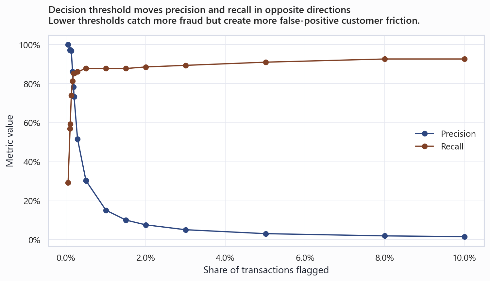

# Credit Card Fraud Risk Strategy

This repository builds a fraud scoring workflow on the public Kaggle/ULB credit card fraud dataset. The focus is threshold selection: fraud captured, false positives, review volume, customer friction, and expected cost.

## Project Summary

| Area | Details |
|---|---|
| Business question | Which fraud threshold produces the best operating tradeoff between fraud capture, review cost, and customer friction? |
| Data | Public Credit Card Fraud Detection dataset from the Machine Learning Group at Universite Libre de Bruxelles. |
| Methods | Class-imbalance analysis, amount and time profiling, logistic regression, tree model, PR-AUC evaluation, threshold economics. |
| Main outputs | Summary report, strategy deck, model card, threshold scenarios, Power BI-ready exports. |
| Tools | Python, pytest, DuckDB SQL, Power BI build documentation. |

## Key Findings

| # | Finding | Evidence |
|---|---|---|
| 1 | Fraud is extremely rare. | 492 frauds out of 284,807 transactions, or 0.173% of rows. |
| 2 | Amount risk is tail-heavy but not simple. | Fraud has a higher mean amount than legitimate transactions, but a lower median. |
| 3 | The tree model gives the best operating surface. | Holdout PR-AUC is about 0.845 versus 0.704 for the logistic baseline. |
| 4 | The cost-balanced threshold is the practical recommendation. | A 0.25 score cutoff flags about 0.19% of transactions with 78.4% precision and 85.4% recall. |
| 5 | Deployment should be tiered. | High-risk auto-decline, middle-risk review or step-up authentication, and low-risk allow/monitor. |



## Data

The project uses the public [Credit Card Fraud Detection](https://www.kaggle.com/datasets/mlg-ulb/creditcardfraud) dataset from the Machine Learning Group at Universite Libre de Bruxelles. Features `V1` through `V28` are PCA-anonymized, so the project does not make merchant, device, geography, or customer-driver claims.

The full raw file and a smaller stratified sample are included in `data/`. Source notes are documented in [data-sources.md](data-sources.md) and [data/data_manifest.md](data/data_manifest.md).

## Methodology

1. Validate schema, missingness, duplicate rows, class imbalance, amount distribution, and elapsed-time patterns.
2. Define a cost model that includes missed fraud, chargeback/admin fees, review cost, and false-positive customer friction.
3. Train a class-weighted logistic regression baseline and a tree-based model with oversampling support.
4. Evaluate with PR-AUC, precision, recall, ROC-AUC as supporting context, and threshold tables.
5. Compare aggressive, cost-balanced, and conservative deployment policies.

## Repository Contents

| Path | Purpose |
|---|---|
| [notebooks/](notebooks) | Fraud risk analysis notebook. |
| [src/fraud_risk/](src/fraud_risk) | Data, model, cost, and visualization code. |
| [scripts/](scripts) | Download, EDA, modeling, SQL export, deck, and notebook scripts. |
| [outputs/](outputs) | Model card, metrics, threshold scenarios, and generated tables. |
| [reports/](reports) | Summary report, strategy deck, and generated figures. |
| [sql/](sql) | DuckDB validation and KPI exports. |
| [power-bi/](power-bi) | Dashboard brief, data model, DAX, refresh steps, and mockups. |
| [tests/](tests) | Unit tests for data and cost behavior. |

## Reproduce

Requires Python 3.11+.

```bash
git clone https://github.com/shalom-wu/credit-card-fraud-risk-strategy.git
cd credit-card-fraud-risk-strategy
python -m venv .venv
pip install -r requirements.txt
pip install -e .

python scripts/run_all.py
python scripts/run_sql.py
pytest
```

On Windows, activate the virtual environment with `.venv\Scripts\activate`. On macOS/Linux, use `source .venv/bin/activate`.

## Reporting Layer

SQL validates the transaction data and computes class balance, amount-band risk, fraud-by-hour cuts, threshold economics, and scenario comparisons. The SQL runner exports dashboard-ready data to `data/powerbi/`.

The [power-bi/](power-bi) folder contains a dashboard brief, data model, DAX, refresh steps, manual build instructions, and mockups. No placeholder `.pbix` file is included.

## Limitations

- PCA-anonymized features limit business-readable interpretation.
- The dataset is a public benchmark and does not represent a live fraud environment.
- Cost assumptions are transparent but should be replaced with real issuer economics in production.
- `Time` is relative elapsed time, not true time of day.
- A production system would need fresher data, customer and merchant features, and drift monitoring.

## License And Credit

MIT License. Copyright (c) 2026 Shalom Wu.

Data credit: Machine Learning Group, Universite Libre de Bruxelles, Credit Card Fraud Detection dataset hosted on Kaggle. See [data-sources.md](data-sources.md) and [data/data_manifest.md](data/data_manifest.md).
