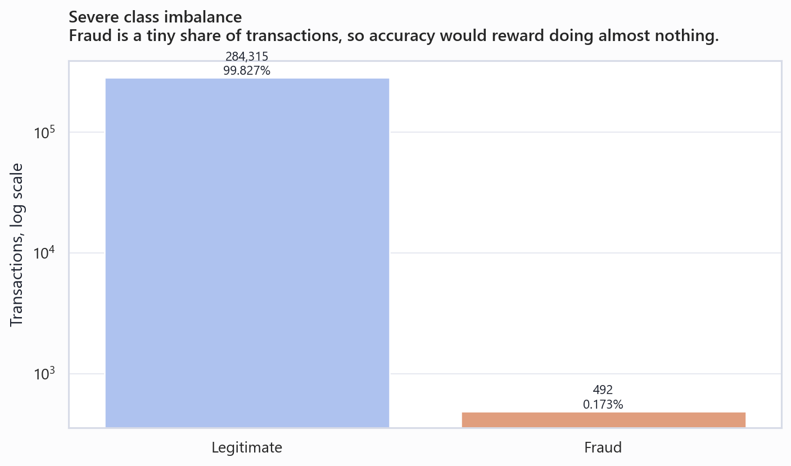
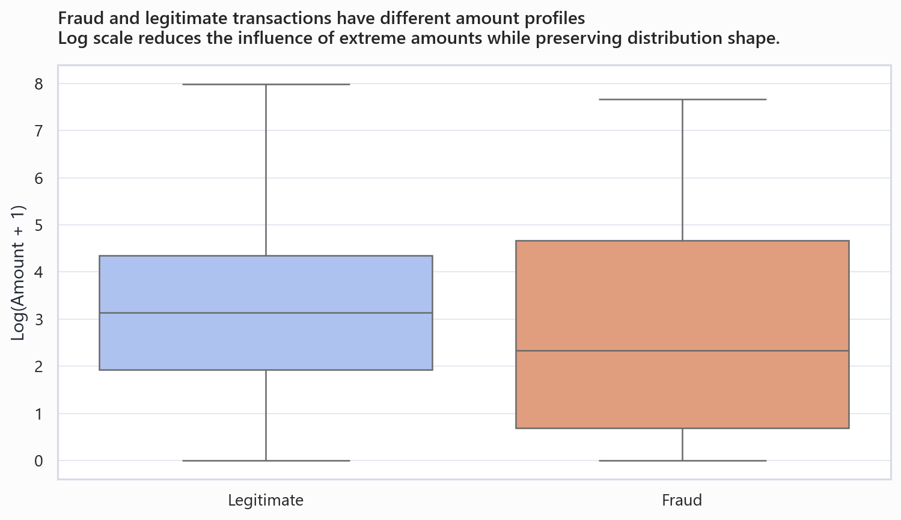
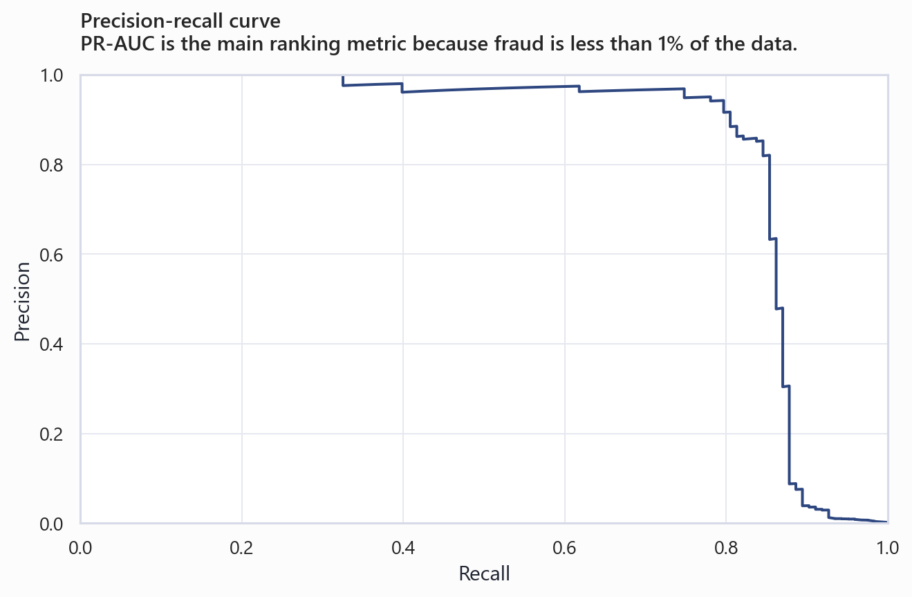
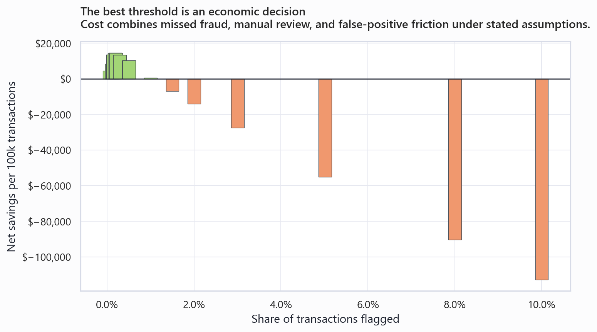

# Transaction Fraud Detection & Risk Strategy

Source: Kaggle/ULB credit card fraud dataset. Features V1-V28 are
PCA-anonymized, so this project emphasizes threshold economics rather than
overstated feature-level explanations.

---

## 1. Problem framing: the tradeoff is not "catch everything"

- The dataset contains **284,807 transactions** and **492 frauds**.
- Fraud rate is **0.173%**, so plain accuracy is not decision-useful.
- The business problem is a cost tradeoff: missed fraud creates direct loss, but false positives create review cost, blocked legitimate transactions, customer friction, and possible churn.

---

## 2. Key descriptive findings

- Fraud transactions total **$60,128** in this public sample window.
- Fraud has a higher mean amount than legitimate transactions, but lower median amount. That implies a tail-risk problem, not a simple "high amount equals fraud" rule.
- The derived hour pattern is only relative elapsed time. The dataset does not expose real customer local time, merchant, cardholder, or geography fields.

---

## 3. Model performance: optimize for PR-AUC and operating threshold

- Selected model: **Tree model with Random oversampling fallback**.
- Holdout PR-AUC: **0.845**.
- Holdout ROC-AUC: **0.975**, reported only as supporting context.
- At the default 0.50 threshold, precision is **86.2%** and recall is **81.3%**. The better decision is to tune the threshold against cost.

---

## 4. Cost comparison: current-state assumption vs model-assisted decisioning

- Current-state assumption: no model-assisted intervention in the scored population, so fraud in the holdout sample is not blocked by this project.
- Default model-assisted cost includes missed fraud, manual review, and false-positive customer friction.
- Recommended threshold improves economics by **$14,543 per 100,000 scored transactions**.
- This is normalized per 100k transactions so it can be scaled to a card issuer's actual volume.

---

## 5. Deployment scenarios

- **Aggressive review**: threshold 0.050, flags 0.50% of transactions, precision 30.4%, recall 87.8%, net savings $10,298 per 100k scored.
- **Cost-balanced default**: threshold 0.250, flags 0.19% of transactions, precision 78.4%, recall 85.4%, net savings $14,543 per 100k scored.
- **Conservative flagging**: threshold 0.987, flags 0.05% of transactions, precision 100.0%, recall 29.3%, net savings $4,557 per 100k scored.

---

## 6. Recommended approach

Use a **tiered risk policy** rather than one blunt block/allow threshold:

1. Auto-decline only the highest-risk band where precision is strong and the expected fraud loss exceeds customer-friction cost.
2. Send the middle-risk band to manual review or step-up authentication.
3. Allow low-risk transactions, but keep monitoring for drift and new fraud patterns.

The cost-balanced threshold is the starting point, not a permanent rule. Review
capacity, false-decline harm, regulatory tolerance, and fraud drift should
drive the final threshold.

---

## 7. Appendix: methodology, imbalance handling, and limitations

- Data: public Kaggle/ULB anonymized European card transactions.
- Features: `Time`, `Amount`, and PCA-anonymized `V1` through `V28`.
- Modeling: class-weighted logistic regression baseline plus a tree model with resampling for the fraud minority class.
- Evaluation: PR-AUC, precision, recall, threshold tables, and cost per 100k scored transactions.
- Limitation: anonymized features prevent credible feature-level "why" explanations. The strongest original contribution is the false-positive cost framing and threshold/deployment reasoning.

---

## Assumptions to confirm before finalizing a public deck

- What false-positive cost should represent for the target audience: manual review only, customer friction, churn, or all of the above.
- Whether the current-state benchmark should assume no model intervention, an existing rules engine detection rate, or a known fraud operations baseline.
- Review capacity per 100k transactions and acceptable customer-friction tolerance.
- Whether to annualize results using a specific card issuer transaction volume, or keep all figures normalized per 100k scored transactions.
